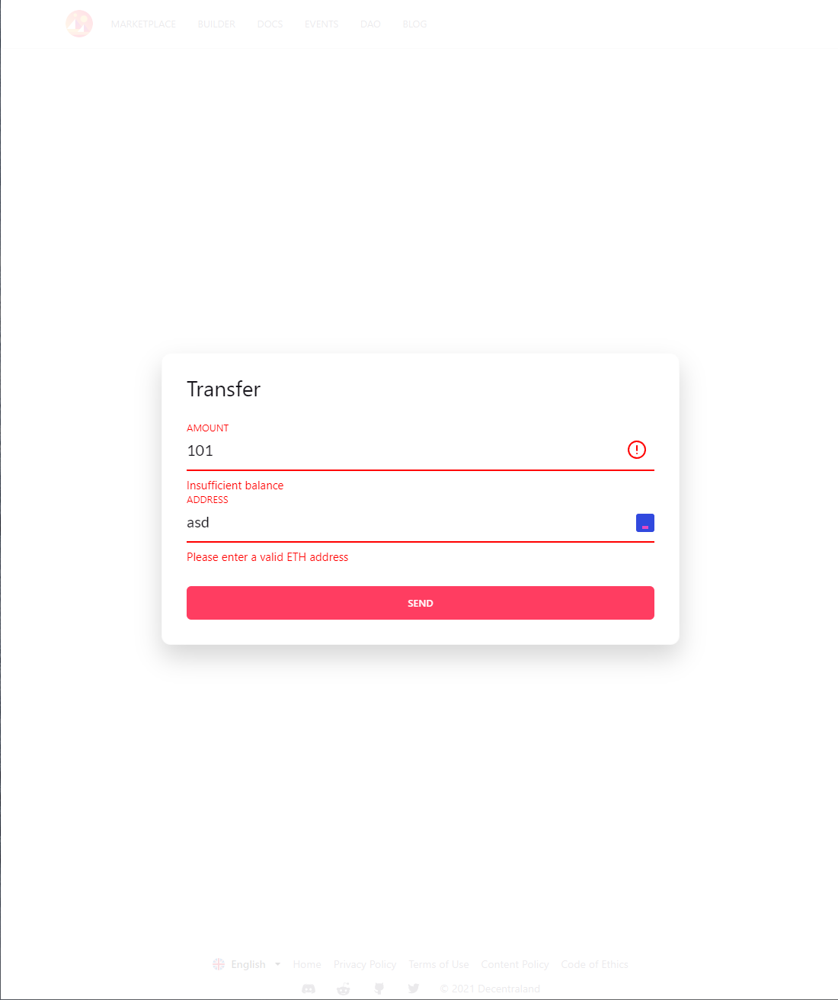

## Setup

1. Run `cp .env.example .env` and fill the environment variables
2. Run `npm install`
3. Run `npm start`

You will also need to setup a local ethereum development environment and deploy the Dummy Token there, to do that [follow these instructions](https://github.com/decentraland/dummy-token#setup).

## Features included

- Routing: Implemented `connected-react-router` to handle the route changes and manage side-effects and components to render.
- Network detection: The project will only allow the user to use the localhost network (ID: 1337). I tried to use `wallet_switchEthereumChain` to change the network programatically but unfortunately looks like MetaMask doesn't support changing it the localhost one.
  .
- Account change detection: Re-fetch the token balance on the account change event.
- Transfer validation: `react-hook-form` was used to provide a basic validation during the token transfer. It will validate the address is a valid ETH one, that the amount is positive and that the user has the balance to make that transfer.
  
- Testing: the logic included in the sagas was testing using `redux-saga-test-plan`.

## Notes / Future improvements

- Note that the `transfer` reducer has a `Transfer[]` in its state. I was planning to create a history of transactions but I was already extended from the original request.
- A validation that is contract address is valid while fetching the token should be included.
- I haven't found a use case for using `reselect`. I've used it in the past to avoid heavy computations repetition but I couldn't find a good usage from it in here.
